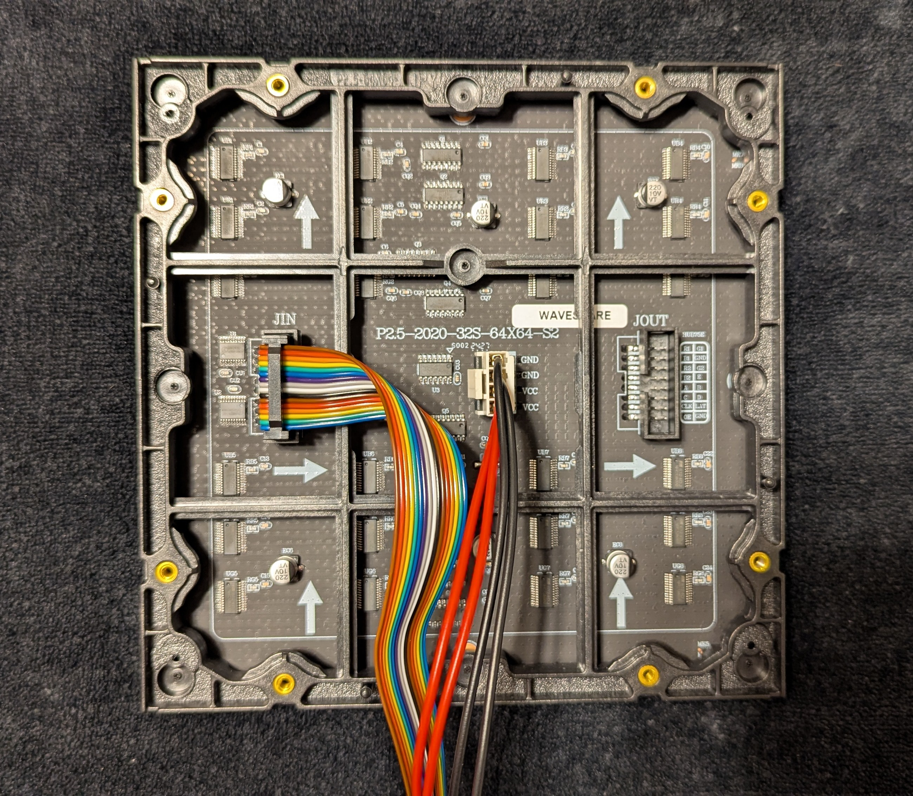
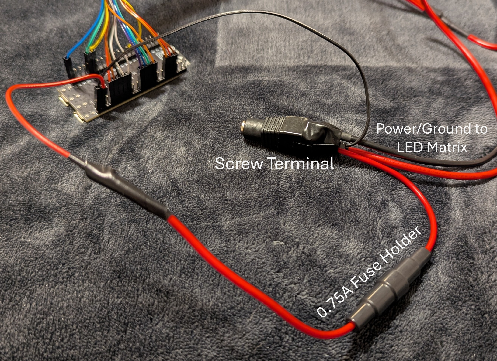
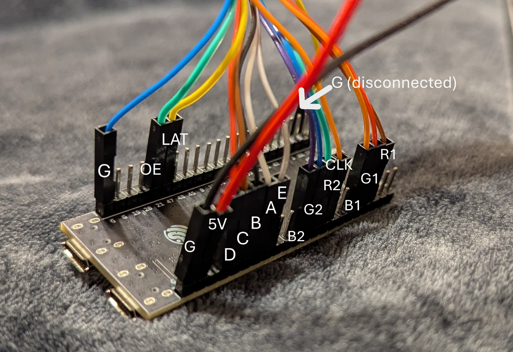

# ESP32 HUB75 LED Matrix Pong Animation  

A simple Pong-inspired animation rendered on a **64×64 HUB75 RGB LED matrix** using an **ESP32-S3 DevKitC-1**.  
The paddles automatically track the ball, so the animation loops indefinitely.  

This project isn’t a full Pong game — it’s a **hardware demo** designed to:  
- Showcase smooth ~60 FPS animation on HUB75 LED matrices.  
- Demonstrate structured, memory-conscious C++ for embedded systems.  
- Provide a clean starting point for other ESP32 LED matrix projects.  

---

## Demo  

  

---

## Hardware Setup  

### Panel & Connections  
  
*Back of the 64×64 RGB matrix showing the HUB75 input connector and power terminals.*  

### Power Wiring  
  
*ESP32 powered from a regulated 5V PSU with a **0.75 A fuse** for added safety.  
The fuse prevents the ESP32 from overdrawing current, since the LED matrix is capable of much higher currents.*  

### ESP32 Pinout  

| Signal | ESP32-S3 Pin |
|--------|--------------|
| R1     | 4            |
| G1     | 5            |
| B1     | 6            |
| R2     | 17           |
| G2     | 18           |
| B2     | 8            |
| A      | 10           |
| B      | 11           |
| C      | 12           |
| D      | 13           |
| E      | 9            |
| LAT    | 47           |
| OE     | 21           |
| CLK    | 16           |

  
*Pin mapping between the ESP32-S3 DevKitC-1 and the HUB75 connector.*  

---

## Software  

- **Platform:** Arduino (ESP32 board support package)  
- **Library:** [ESP32-HUB75-MatrixPanel-I2S-DMA](https://github.com/mrfaptastic/ESP32-HUB75-MatrixPanel-I2S-DMA)  
- **Frame Timing:** Non-blocking `millis()` loop, targeting ~60 FPS  
- **Memory:** Minimal types (`uint8_t`, `int8_t`) chosen to keep RAM/flash usage small  

Key features in the code:  
- No “magic numbers” — all paddle, margin, and panel dimensions are parameterized.  
- Paddles adjust automatically to different matrix resolutions and sizes.  
- Simple AI makes paddles track the ball (no misses, intentional).  

---

## Running the Project  

1. Install Arduino IDE with **ESP32 support**.  
2. Install the `ESP32-HUB75-MatrixPanel-I2S-DMA` library.  
3. Open `esp32_hub75_pong_animation.ino`.  
4. Update pin mappings in the source if your wiring differs.  
5. Upload to an ESP32-S3 DevKitC-1 (or another ESP32 with enough RAM).  
